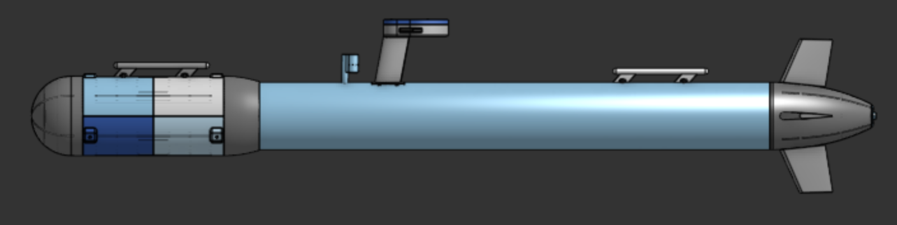
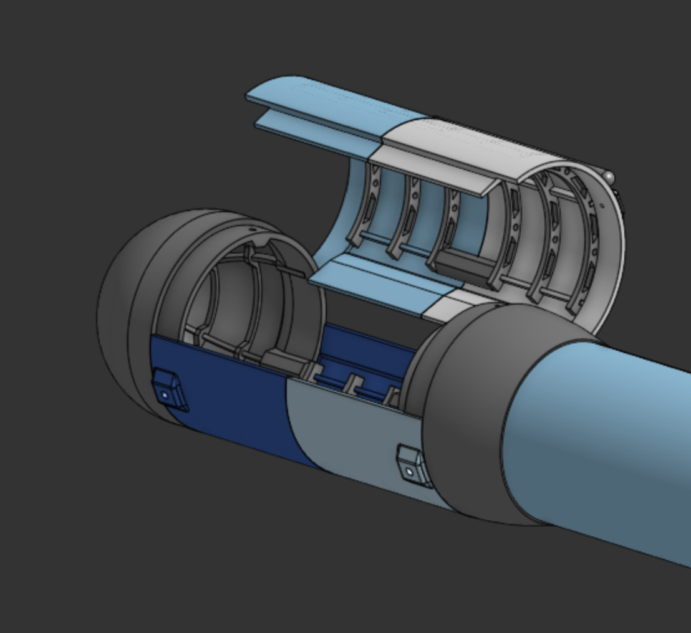
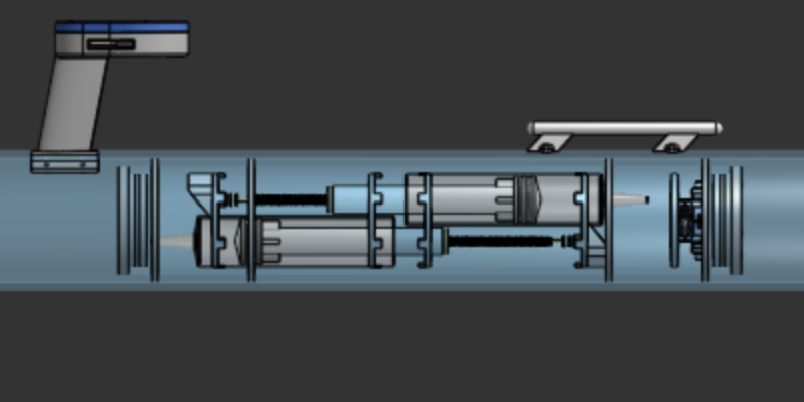
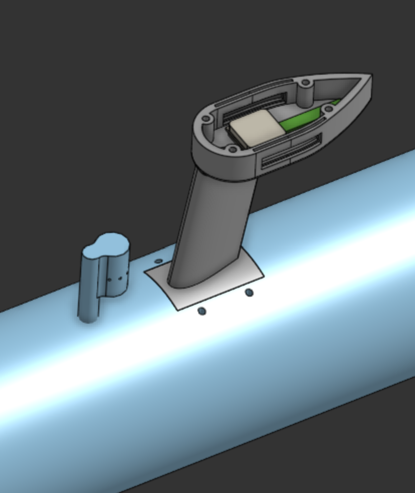
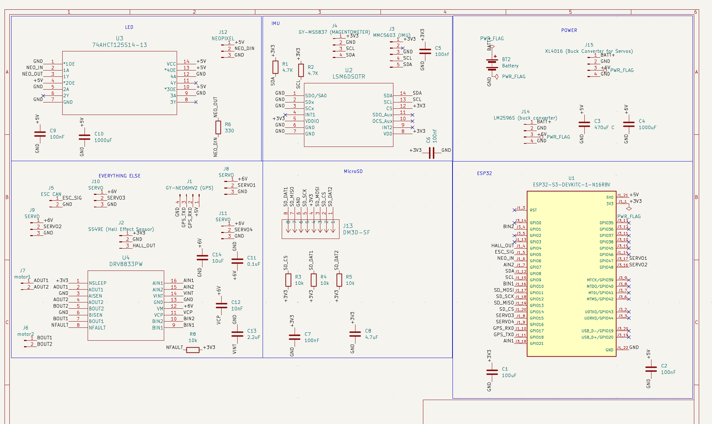
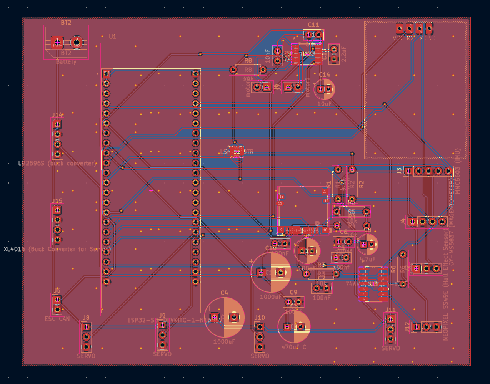

# Unflying Fish

The main goal of the project was to create a full autonomous underwater vehicle capable of traveling below the surface with no signal. Water completely blocks out both GPS and WIFI, so we will have no connection at all once it submerges below the surface. Thus, the submarine can use gps to navigate above water to various waypoints and use dead-reckoning when navigating underwater.

## Design

### Ribbed Hull
For all the 3D printed parts be decided to go with a modular ribbed hull design as it was significantly more efficient in filament. It also greatly reduced support material and made many parts much more printable. The hull works by having a mostly thin outer shell (1.4mm) with several 4mm ribs running across. Then, rings would be nested in these ribs to further support both the walls and anything inside.

### Ballast System
One of the more complicated aspects of the sub was the ballast system. Many other submarines use compressed air to fill a tank, but that requires a pump and only functions a few times before air runs out. Instead, we decided to use a dual approach with a lead screw driving two syringes for precise ballast control. Then, once at the surface and air-pump will fill up plastic bags to push the sub fully out of the water.

### Antenna Tower
The antenna tower is relatively simple, housing both the GPS and ESP-32 Wifi antenna for signal. It also has a window to house LEDs to make the sub more visible when it is barely emerged from the surface.

## Electronics
The project features a custom control board with all sensors soldered, with the exception of a few modules which we opted to be breakouts to limit corruption of signal. The board is optimized to limit noise, and includes a ground pour. The board was fully designed in KiCad within the size constraints laid out by CAD.

The craft is powered by an ESP32 S3 with a 4S LiPo battery.

## Software
The projects code will be written in PlatformIO and feature a web-based interface to launch missions, automatic surfacing, and fault-recovery. We will use dead-reckoning to localize the crafts position based on a number of sensors, including custom water flow rate, magnetometer, and gps re-centering on surface. We will account for current using the magnetometer, thrust, and flow rate sensor. The code architecture is fully defined, and the code will be written once the craft is built and verified to ensure efficiency and accuracy.

## Bill Of Materials
| Item | Quantity | Cost (USD) | Purchase Link |
|---|---:|---:|---|
| LIPO Converter | 1 | $6.58 | https://www.aliexpress.us/item/3256810183858580.html |
| Wires | 1 | $11.56 | https://www.aliexpress.us/item/3256805055649344.html |
| Resistors | 1 | $6.49 | https://www.amazon.com/Resistor-Resistors-Assortment-Breadboard-Electronics/dp/B0F4P352BB |
| Servos (Pack of 4) | 1 | $17.98 | https://www.amazon.com/Deegoo-FPV-Servo-MG995-Metal-Gear/dp/B07NQJ1VZ2 |
| Breakout (Servos) | 1 | $9.45 | https://www.aliexpress.us/item/3256809858578105.html |
| Power Switch | 1 | $2.27 | https://www.aliexpress.us/item/3256809415854105.html |
| Fuses | 1 | $6.76 | https://www.aliexpress.us/item/3256812122080166.html |
| Capacitors | 1 | $9.99 | https://www.amazon.com/ALLECIN-Electrolytic-Capacitor-Assortment-Kit/dp/B0C1VBXCQM |
| Fuse Mounts | 1 | $11.12 | https://www.aliexpress.us/item/3256808052693050.html |
| Servo Connectors and Crimper | 1 | $24.99 | https://www.amazon.com/Female-Connector-Crimping-Compatible-Spektrum/dp/B0BGX7157Y |
| LEDs | 1 | $8.18 | https://www.aliexpress.us/item/3256806580504872.html |
| Level Shifter for LEDs | 1 | $0.26 | https://www.digikey.com/en/products/detail/diodes-incorporated/74AHCT125S14-13/7724623 |
| GPS Extension Cable | 1 | $6.99 | https://www.amazon.com/POBADY-Female-1-37mm-Low-Loss-Extension/dp/B0C8M8PCJ2 |
| Micro SD Slot | 1 | $2.32 | https://www.digikey.com/en/products/detail/hirose-electric-co-ltd/DM3D-SF/1786510 |
| Decoupling Capacitor | 1 | $2.68 | https://www.aliexpress.us/item/3256811909247133.html |
| Ballast Motor | 2 | $5.93 | https://www.aliexpress.us/item/3256807765699539.html |
| DC Motor Driver | 1 | $2.70 | https://www.digikey.com/en/products/detail/texas-instruments/DRV8833PW/4251165 |
| Ballast Air Motor | 1 | $8.54 | https://www.amazon.com/Jadeshay-Micro-Vacuum-Electric-PumpingBooster/dp/B089ZRYZV8 |
| M3 Screws and Heat Set Inserts | 1 | $15.99 | https://www.amazon.com/Threaded-Inserts-Plastic-3mm-10mm-Pringting/dp/B0GYRQG7F2 |
| PETG | 1 | $46.99 | https://www.amazon.com/SUNLU-PETG-Filament-1-75mm-Printer/dp/B0D1KBQ9VL |
| 4in PVC Pipe | 1 | $38.46 | https://www.homedepot.com/p/Charlotte-Pipe-4-in-x-10-ft-PVC-Schedule-40-DWV-Pipe-PVC074000600/100348477 |
| 3in PVC Pipe | 1 | $21.81 | https://www.homedepot.com/p/Charlotte-Pipe-3-in-x-10-ft-PVC-Schedule-40-Foam-Core-DWV-Pipe-PVC-04300-0600/100348479 |
| Silicone Tubing | 1 | $11.99 | https://www.amazon.com/Hooshing-Silicone-Flexible-Winemaking-Transfer/dp/B08PTXZ51Q |
| Hose Clamps (Tubing) | 1 | $5.19 | https://www.amazon.com/Jersvimc-12pcs-Stainless-Plated-Adjustable/dp/B0BZSKH624 |
| Hose Clamps (Hull) | 1 | $9.99 | https://www.amazon.com/EesTeck-Adjustable-Stainless-Clamps-Ducting/dp/B08B43QT5Y |
| Hose Clamps (Hull) Custom | 1 | $9.99 | https://www.amazon.com/OURU-Clamp-Fasteners-Stainless-Clamps/dp/B0BHZ93JTZ |
| O-Rings | 1 | $8.29 | https://www.amazon.com/XBVV-Nitrile-Assortment-Plumbing-Connections/dp/B0CBTYXVCV |
| Float Balls | 1 | $5.79 | https://www.amazon.com/uxcell-100pcs-Plastic-Bearing-Precision/dp/B0DZWW9C2V |
| Fiberglass Roll | 1 | $12.99 | https://www.amazon.com/Fiberglass-Chopped-Use%EF%BC%8CStrong-Structural-Reinforcement/dp/B0F8TR7Z27 |
| Hose Barb | 1 | $6.39 | https://www.amazon.com/HARFINGTON-Fitting-Splicer-Printing-Compressor/dp/B0FKMMKW9S |
| M4 Heat Set | 1 | $5.99 | https://www.amazon.com/Aoserge-100Pcs-Brass-Heat-Inserts/dp/B0FM3XZZ56 |
| Servo Bellows | 1 | $8.99 | https://www.amazon.com/10Pcs-Waterproof-Push-Rubber-Bellow/dp/B0749L64KJ |
| Syringe | 1 | $9.99 | https://www.amazon.com/Syringe-Without-Needle-Plastic-Syringes/dp/B0C39RWFJZ |
| 4in PVC Pipe O-Ring | 1 | $10.27 | https://www.amazon.com/240-Buna-N-Ring-Durometer-Round/dp/B0051XXMXI |
| 3in PVC Pipe O-Ring | 1 | $6.99 | https://www.amazon.com/uxcell-Nitrile-Automotive-Plumbing-Durometer/dp/B0FNMJNDVR |
| Lead Screws | 1 | $10.04 | https://www.aliexpress.us/item/3256805576723890.html |
| Galvanized Wire | 1 | $7.28 | https://www.amazon.com/Hillman-Galvanized-Solid-Utility-Silver/dp/B00FX982K8 |
---
| Category | Cost (USD) |
|---|---:|
| AliExpress Shipping | $9.58 |
| Underwater Thruster Shipping | $19.00 |
| DigiKey Shipping | $6.65 |
| Adafruit Shipping | $6.52 |
| Home Depot Shipping | $0.00 |
| Amazon Shipping | $0.00 |
| **Total (pre-shipping)** | **$538.75** |
| **Total (post-shipping)** | **$580.50** |
---
